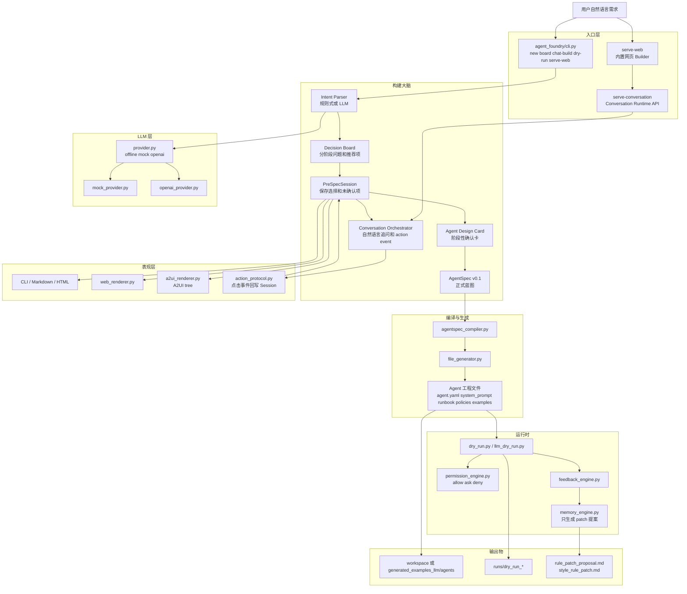

# Agent Foundry 项目结构图

这张图按当前代码结构整理，重点是让人一眼看清主链路和模块边界。

## 怎么看

第一层是入口。`agent_foundry/cli.py` 承接 CLI、Web 服务和 Conversation API。

第二层是 Builder。它把一句话需求变成决策面板，再变成 `PreSpecSession`，最后生成 `AgentSpec`。

第三层是表现层。CLI、Web、A2UI 都只是渲染同一个决策状态，再把操作回写成 action event。

第四层是编译与运行时。Compiler 生成 Agent 工程文件，dry run 再读取这些文件跑验证流程。

最重要的边界是：LLM 负责提案和理解，确定性代码负责权限、编译、文件生成和高风险动作边界。
